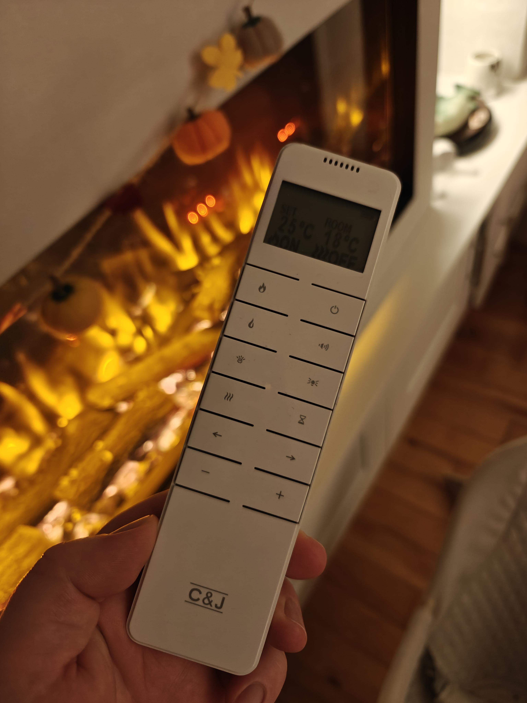

# ESP32 Controller for Charlton & Jenrick Fireplace

This project uses an **ESP32-WROOM-32** and a **CC1101** 433 MHz transceiver to control a fireplace using a captured 2-FSK RF payload.  
It integrates with **Home Assistant via MQTT** and also exposes a **simple web interface** with ON/OFF buttons.

<div style="display:flex;margin:auto;height:550px;">
    
</div>

## Hardware

- ESP32-WROOM-32 dev board (e.g. ESP32 DevKit)
- CC1101 433 MHz module
- 3.3 V power (CC1101 must **not** be powered from 5 V)

**Note**: This has only been test with an `ESP32-WROOM-32`, but it is more than likely other ESP32 board will work as well, or need just some minor configuration changes to work. Pull requests are welcome.

### Wiring

| CC1101 pin | ESP32 pin | Notes          |
|------------|-----------|----------------|
| VCC        | 3V3       | 3.3 V only     |
| GND        | GND       | Common ground  |
| CSN (CS)   | GPIO5     | Chip select    |
| SCK        | GPIO18    | SPI SCK        |
| SO (MISO)  | GPIO19    | SPI MISO       |
| SI (MOSI)  | GPIO23    | SPI MOSI       |
| GDO0       | GPIO21    | Used by library|
| GDO2       | —         | Not connected  |

## Software

- [PlatformIO](https://platformio.org/)
- Framework: Arduino (ESP32)
- Libraries:
  - `mfurga/cc1101` – CC1101 driver
  - `knolleary/PubSubClient` – MQTT client

### `platformio.ini`

```ini
[env:esp32dev]
platform = espressif32
board = esp32dev
framework = arduino
monitor_speed = 115200

lib_deps =
  mfurga/cc1101@^1.2.0
  knolleary/PubSubClient@^2.8
```

### Build & Install

Connect your ESP32-WROOM-32 dev board and run the following command:

```bash
platformio run -e esp32dev --target upload
```

Once the upload is complete, you can run the following to see the serial output from your module:

```bash
pio device monitor -b 115200
```

### Usage

Once an IP has been assigned, you can go view and interact with the controller from the web UI, simply visit the IP assigned on port `80` -> `${ASSIGNED_IP}:80`

<div style="display:flex;margin:auto;">
    
</div>

